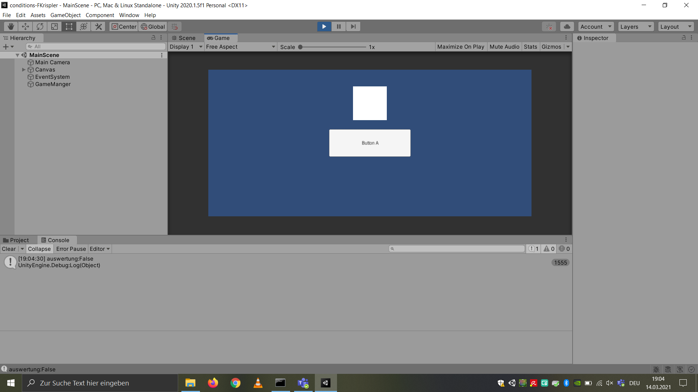
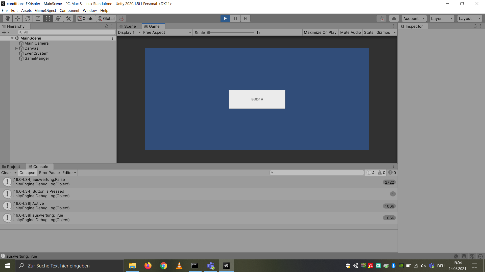

# Template2D-Unity202015f1

### Project description: 
Conditions 

### Development platform: 
Unity 2020.1.5f, Visual Studio 2019

### Target platform: 
WebGL

### Visuals: 
Screenshots from Unity:

### Project state: 
100%

### Lessons Learned: 

contitions, true / false, 

Copyright by FKrispler
